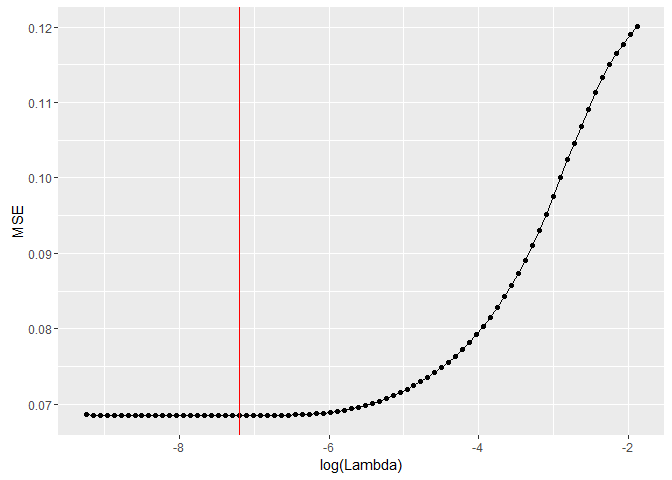

Making a simple model with data generated from tweets
================
Erik Brorson
January 30, 2017

Read first
----------

This is a short demonstration of the text processing capabilities of R as well as a very basic example of how one can go from text based data to a simple model. It showcases a way of turning human-readable tweets into numerical data.

The data used in this example comes from the Kaggle competition called *Partly Sunny with a Chance of Hastags*. The dataset was contributed by the data library CrowdFlower and contains labelled tweets about the weather. I will use the training set provided for this competition and aims to build a model that predicts the negative sentiment of each tweet.

Let's get computing!

Looking at the data and building the toolbox
--------------------------------------------

Since we are going to do some data munging to get everything nice and orderly we use the tidyverse, readr to read data from the harddrive efficiently and tibble to store it in memory. GGplot2 creates nice visualizations. The real work horse in this example is the fantastic tm, or *text mining* package which supplies us with the option of transforming the tweets into numerical data. At last we are going build a LASSO regression model and keep the modelling data stored in a sparse matrix format that only keeps the non zero elements of the matrix.

``` r
library(tidyverse)
library(tm)
library(Matrix)
library(glmnet)
```

We read in the data but only keep two variables, the tweet itself and the column s2 that corresponds to the negative sentiment of the tweet. We also store the s2 values as a matrix for the later modelling.

Below are 10 tweets printed out, ordered by the negativity score.
``` r
#Read data from csv-file
tweetData <- read_csv(file = "train.csv", col_types = cols_only(tweet = col_character(),
                                                            s2 = col_double()))

#Save negative sentiment in a vector that is to be predicted in later modelling
s2 <- as.matrix(tweetData$s2)

#Print some tweets ordered by negative sentiment
arrange(tweetData, desc(s2))
```

    ## # A tibble: 77,946 × 2
    ##                                                                          tweet
    ##                                                                          <chr>
    ## 1  I'm gonna do big things today: running during shit weather and writing my e
    ## 2                                                @mention cold cloudy rainy :(
    ## 3                                                             too hot out here
    ## 4  I'm SO happy we're getting this race in today but goodness... This humidity
    ## 5             My client said its not cold outside girl puhlezz its bur is shyt
    ## 6            Dang only 72degrees today, where is all the warm spring weather??
    ## 7  @mention I do have to agree with you, My lawn is getting about 12" tall, It
    ## 8  RT @mention: Sick of wearin a hoodie one day n the next day wearin flip flo
    ## 9  I hate when a shoot is cancelled & rescheduled due to weather then an hour 
    ## 10                                        My boxer is not liking this weather!
    ## # ... with 77,936 more rows, and 1 more variables: s2 <dbl>

If we take a closer look at the tweets we say that they, not surprisingly, are about the weather. They also carry some sort of negative sentiment. Our goal of this analysis is to build a simple model that predicts the negativity score of these tweets. We are going to use a linear model were each word is given a score. The total predicted score of tweet will be the sum of the individual scores in each tweet that may have a non-zero score. 

We are assuming that some words are useless for our analysis, these are called *Stop Words*. Some examples of these words are *I*, *and*, *such*, and *them*, it is clear that these words does not carry any interesting information. We remove these words in the code below. This is were we use the *tm* package in R. 

``` r
#Create a corpus representation of the tweets
corp <- Corpus(VectorSource(tweetData$tweet))
corp <- tm_map(corp, PlainTextDocument) 
corp <- tm_map(corp, removePunctuation)                     #Removes punctiation
corp <- tm_map(corp, removeWords, stopwords("en"))          #Remove stopwords
corp <- tm_map(corp, stemDocument, language = "english")    #Stem words in the tweets
dtm <- DocumentTermMatrix(corp)                             #Create the matrix and remove unuseful terms
dtm <- removeSparseTerms(dtm, 0.999)
```

``` r
data <- cbind(s2, data.frame(as.matrix(dtm))) 
mat <- sparse.model.matrix(s2~. ,data)                      #Create a sparse model matrix 
                                                            #to be used as input in the model
model <- cv.glmnet(y = s2, x = mat, alpha = 0.5)            #Cross validate the elastic net to tune lambda
```



``` r
finalModel <- glmnet(y = s2, x = mat, alpha = 0.5, lambda = model$lambda.min)
coef <- tibble(variable = row.names(finalModel$beta), beta = as.numeric(finalModel$beta))
arrange(coef, desc(beta))
```

    ## # A tibble: 1,077 × 2
    ##    variable      beta
    ##       <chr>     <dbl>
    ## 1    crappi 0.5117718
    ## 2    shitti 0.4595968
    ## 3   horribl 0.4562549
    ## 4   depress 0.4292953
    ## 5      suck 0.4175831
    ## 6     nasti 0.4157189
    ## 7    dreari 0.4069617
    ## 8     miser 0.3783830
    ## 9      crap 0.3428576
    ## 10  terribl 0.3324477
    ## # ... with 1,067 more rows
